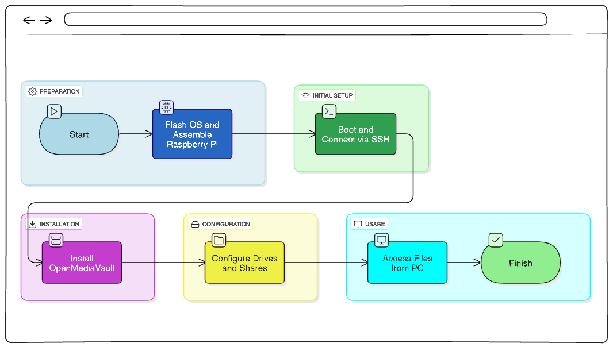
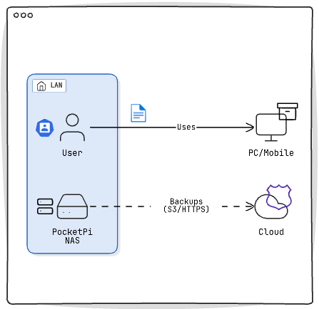
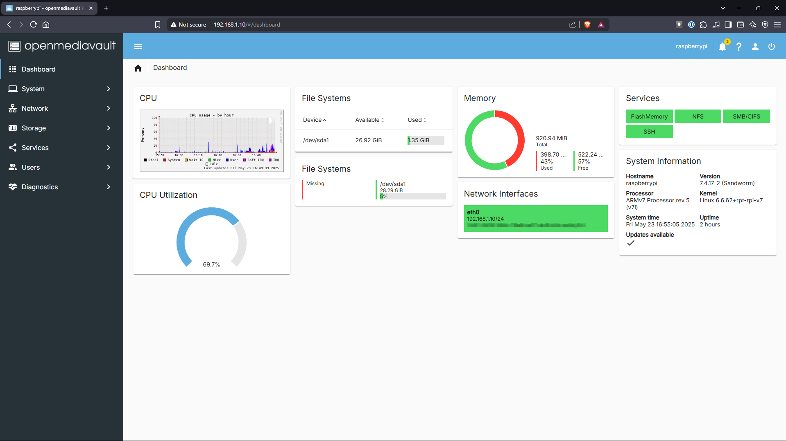

# 🗂️ PocketPi - A Portable Raspberry Pi NAS

A portable, low-cost Network Attached Storage (NAS) system built using a Raspberry Pi 2 Model B and OpenMediaVault. Perfect for local file sharing, backups, and home lab experimentation.


---

## 📋 Table of Contents

- [About The Project](#about-the-project)
- [Key Features](#key-features)
- [Hardware & Software](#hardware--software)
- [Installation & Setup Guide](#installation--setup-guide)
- [Performance & Monitoring](#performance--monitoring)
- [Future Scope](#future-scope)
- [License](#license)


---

## 📖 About The Project

PocketPi transforms a Raspberry Pi into a functional Network Attached Storage (NAS) device. It serves as a cost-effective and power-efficient alternative to commercial NAS solutions, making it ideal for students, hobbyists, and anyone looking to set up a personal cloud for offline backups or a shared drive for a small home network.

The entire system is managed through the OpenMediaVault (OMV) web interface, eliminating the need for a dedicated monitor or keyboard after the initial setup.



---

## ✨ Key Features

- 🖥️ **Fully Headless:** Configured and managed remotely via SSH and a web browser.
- 💽 **Flexible Storage:** Use any USB-connected storage device (Flash Drive, HDD, or SSD).
- 🌐 **Web-Based Management:** An intuitive OpenMediaVault UI for managing storage, users, and services.
- 🤝 **Standard File Sharing:** Supports `SMB/CIFS` for Windows/macOS/Linux clients and `NFS` for Linux/macOS clients.
- 🔌 **Plug-and-Play:** Easy to set up on your local network.

---

## 🛠️ Hardware & Software

### Hardware
* **Raspberry Pi:** Raspberry Pi 2 Model B
* **Storage:** 32GB USB Flash Drive (or any other USB storage)
* **Power Supply:** 5V, 2A micro-USB Power Adapter
* **Network:** Ethernet Cable

### Software
* **Operating System:** Raspberry Pi OS Lite (32-bit)
* **NAS Software:** OpenMediaVault 6 (OMV)
* **Remote Access:** SSH client (like PuTTY or Terminal)



---

## ⚙️ Installation & Setup Guide

Follow these steps to build your own PocketPi.

### 1. Flash Raspberry Pi OS
- Download the Raspberry Pi Imager.
- Choose "Raspberry Pi OS Lite (32-bit)".
- In the advanced options, **enable SSH** and set a `pi` user password. This is crucial for headless setup.
- Flash the OS to your microSD card.

### 2. First Boot & OMV Installation
- Insert the microSD card, connect the Ethernet cable and USB storage drive, and power on the Pi.
- Find your Pi's IP address from your router's admin page.
- SSH into the Pi: `ssh pi@<YOUR_PI_IP_ADDRESS>`
- Run the OMV installation script. This single command installs everything you need:
  ```bash
  wget -O - [https://github.com/OpenMediaVault-Plugin-Developers/installScript/raw/master/install](https://github.com/OpenMediaVault-Plugin-Developers/installScript/raw/master/install) | sudo bash
  ```
### 3. OMV Configuration
- Once the script finishes, access the OMV web UI by navigating to http://<YOUR_PI_IP_ADDRESS> in a browser.
- File System Setup:
* Navigate to Storage -> File Systems.

## 4. Connect from Your PC
- On Windows, open File Explorer, right-click "This PC," and select "Add a network location."
- Enter the path to your share.
- Enter the username and password you created in OMV.

## 🚀 Performance & Monitoring
The system performance is suitable for basic file transfers and backups. The Raspberry Pi 2 B is limited by its 10/100 Mbps Ethernet port and shared USB bus, resulting in transfer speeds of around 7-9 MB/s.

You can monitor CPU, memory, and network usage directly from the OMV dashboard.



## Future Scope – PocketPi NAS

- RAID Implementation for data redundancy
- Port forwarding for remote NAS access
- VPN integration for secure connections
- Advanced firewall rules
- Multi-user authentication with permissions

## 📜 License
This project is licensed under the MIT License - see the [LICENSE](path/to/file) file for details.
